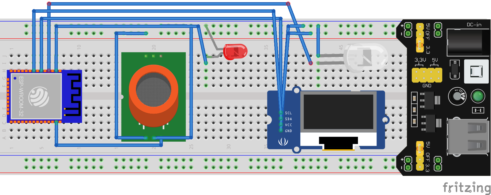
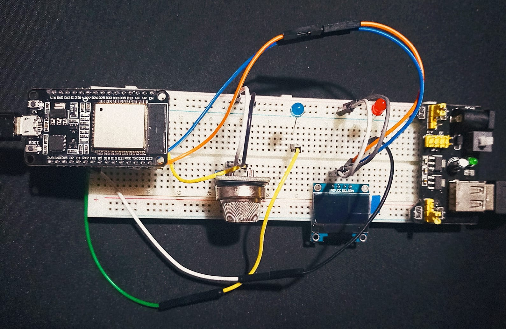

# Gas_Sensor_
Detects methane gas levels in residences using an Esp32 microcontroller programmed with micropython. Register the values ​​in an excel file in Google Drive

# Files
Library SSD1306
 
The SSD1306 library must be imported to configure the oled screen

# Scheme
Circuit diagram
 

# Circuit with Esp32
Gas sensor circuit with Esp32
 

# Graphic
Gas level graph
 

